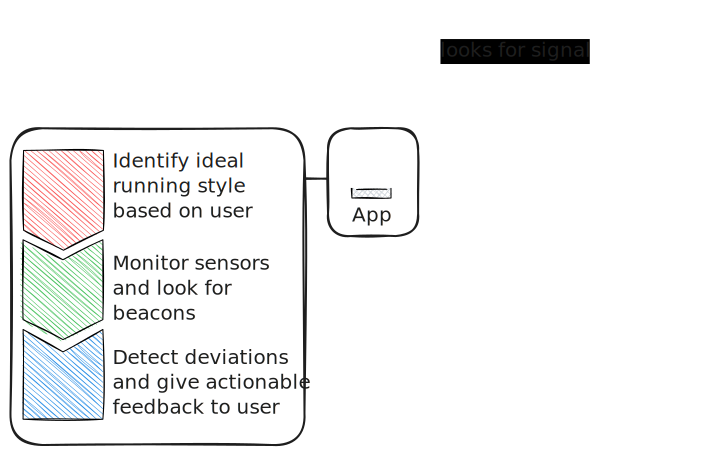
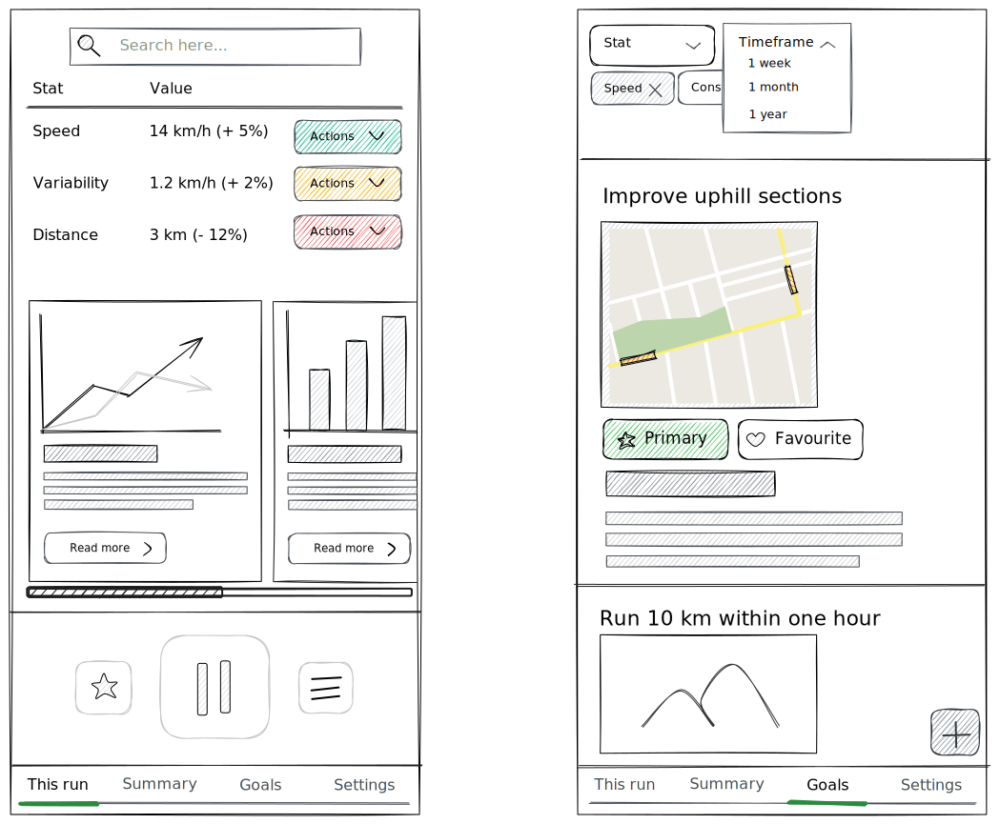
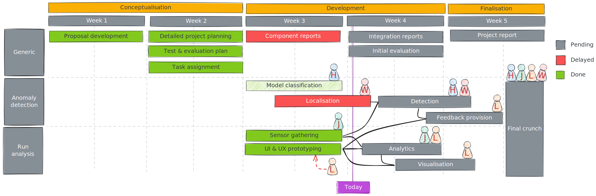

<!--
paginate: true
footer: "Pitch #2 | 2024-10-21"
-->

<!--
_paginate: skip
-->

# <!--fit--> Lodipon

## Team & task distribution

| Name         | Component                             |
| :----------- | :------------------------------------ |
| Huanbo Meng  | Classifier training                   |
| Jinrui Zhang | Sensor data gathering                 |
| Luka Leer    | Visualisation & presentation          |
| Wahab Ahmed  | Localisation                          |

## Quick recap

A **running app** that:

* adapts to **your unique running style** and helps you **stay consistent** when running **longer distances**;
* gives **real-time feedback** and **detects deviations** from **your ideal running style**;
* and uses **beacons as checkpoints** to **precisely track** your speed and segment time.

### Architecture

<!--
_footer: ""
-->

## Progress

We took a critical look at our plans.

### Localisation

* WiGLE sadly does not fit our use-case
  * Too few data points
  * Not exact enough
  * Daily limits on API
* Passive localisation is also not reliable enough
* Solution: BLE beacons as checkpoints

### To machine learn …

* Can automatically detect the user's running style
* Requires less manual user interaction
* Can potentially fit a wider range of preferences

#### Or not to machine learn?

* Initial training made clear that we need a lot of data
* Requires initial runs before the app can be used
* Might not be worth the effort

### User interface & experience

* How to provide feedback to the user?
  * Auditory: only works with earbuds or headphones
  * Tactile: might not be noticeable
  * Visual: can be distracting
* What statistics to show?

#### Prototype

<!--
_footer: ""
-->

## What's next?

## Any questions?
