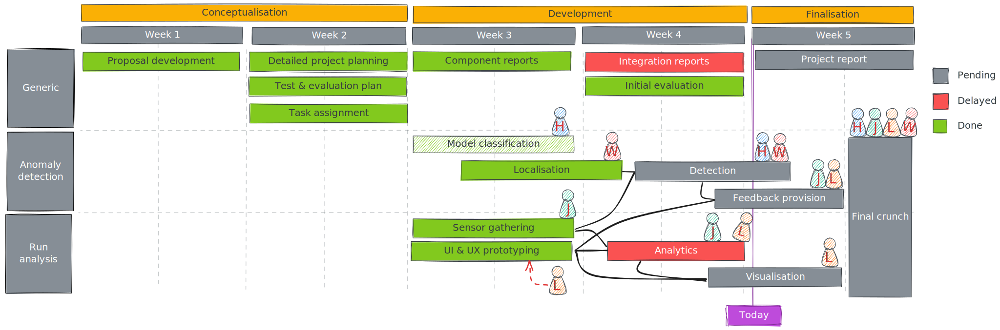

<!--
paginate: true
footer: "Pitch #3 | 2024-10-28"
-->

<!--
_paginate: skip
-->

# <!--fit--> Lodipon

## Team & task distribution

| Name         | Component                             |
| :----------- | :------------------------------------ |
| Huanbo Meng  | Anomaly detection                     |
| Jinrui Zhang | Velocity analysis                     |
| Luka Leer    | Visualisation & presentation          |
| Wahab Ahmed  | Anomaly detection                     |

## Progress so far

### Visualisation

* Monday morning flu
* Monday afternoon flu
* Monday evening flu
* Tuesday flu
* Wednesday flu
* Thursday flu

### The challenge of measuring velocity

* **Acceleration** is, by definition, only the **rate of change**.
* **Velocity** is a relative measure **within a system**.
* What we want, is a **stable and reliable** measure of velocity.

#### The solution

A combination of multiple sources of data:

* Get an **initial velocity** from the **GPS**.
* **Correct** this velocity with the **accelerometer**.
* **Check** the velocity **at fixed points** using the **beacons**.

### Anomaly detection

* **Naive version:** 10% deviation.
* **Improvements:** running patterns and rhythm matching.

## Coming up

## Any questions?
