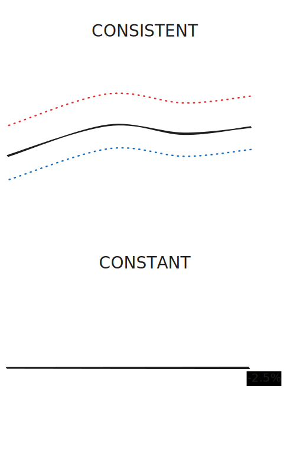

<!--
paginate: true
_footer: "Demo | 2024-11-06"
-->

<!--
_paginate: skip
-->

# <!--fit--> Lodipon

## Team & task distribution

| Name         | Component                                 |
| :----------- | :---------------------------------------- |
| Huanbo Meng  | Anomaly detection                         |
| Jinrui Zhang | Velocity analysis                         |
| Luka Leer    | Visualisation & integration |
| Wahab Ahmed  | Localisation & anomaly detection           |

## What is Lodipon?

A **running app** that:

* helps you **stay consistent** when running **longer distances**;
* **detects deviations** and gives **real-time feedback**;
* and uses **beacons as checkpoints** to **precisely track** your speed and segment time.

## How does it work?

### Sensor gathering

* **Fused location provider**
  * Built-in sensor accumulation
  * Best-effort measure
* To account for **sensor noise**, we used a **sliding window**.

### Anomaly detection

* **Threshold-based**
* Two modes
* **Initial** values are -2.5% and +3.5%
  * Can be adjusted

### Localisation

* **BLE beacons** as **checkpoints**
* **RSSI** for **distance estimation**
* **Sensitivity** and **distance** can be adjusted

### Visualisation & integration

* **Simple** and **intuitive**
* Interaction through **shared view model**
* **Real-time** updates

## Demo time!

---

<!--
_paginate: skip
-->

<video controls muted height="640">
  <source src="asset/demo.mp4" type="video/mp4">
</video>

## Any questions?
